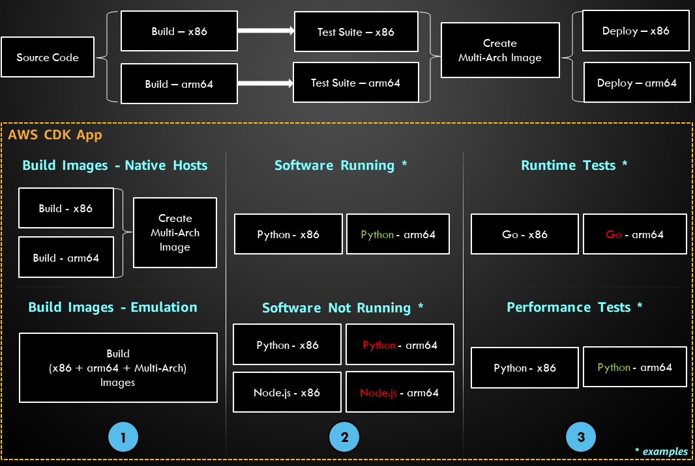
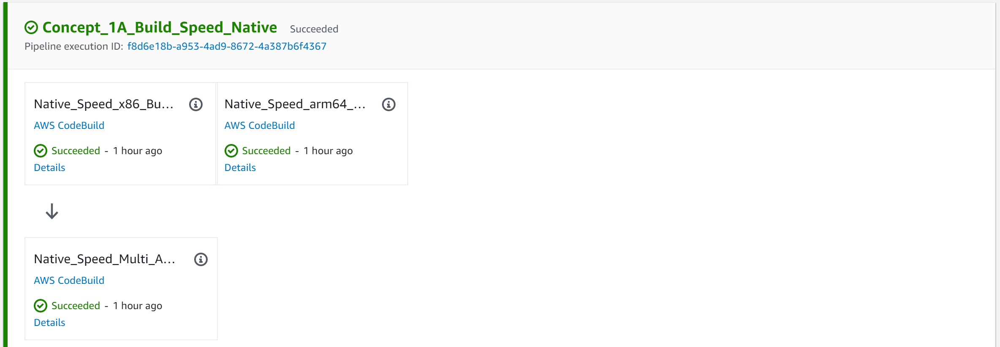
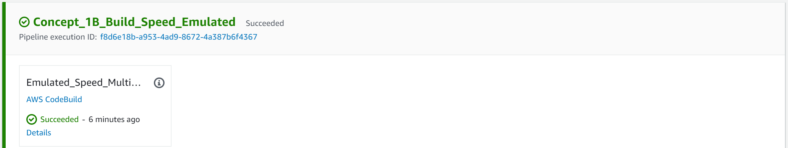
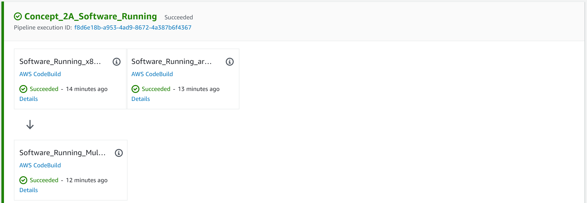
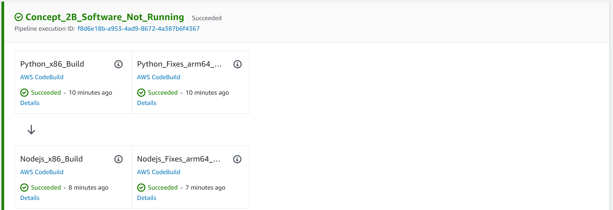
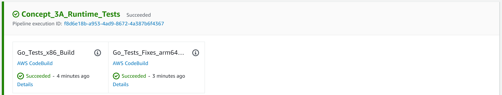
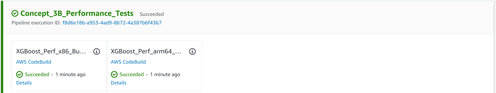

# Demo of Arm64 Software Concepts

> Demo is intended to be delivered by someone with prerequisite knowledge on the topic

In simple terms, the **64-bit Arm-based** AWS Graviton is a **general-purpose CPU**. Since **compute is one of the main cost drivers on the cloud**, Graviton was designed by AWS to be cheaper and faster for popular workloads.

However, Graviton comes with a fundamental difference compared to existing CPUs seen on the cloud. The instruction set architecture (ISA) behind it is arm64-based (as opposed to x86_64 / amd64) and in the software world is known as arm64 / aarch64.

> In short, a compiler changes what it puts in a software binary depending on which machine you run it on or which flags you specify (to point to a different architecture than the host). Once the binary is generated, it is compatible with just that CPU architecture and ISA version. Also, note that the binary file format is compatible with only certain operating systems. Here's an example with the Go language compiler:
```
~/go/bin$ file go
go: ELF 64-bit LSB executable, ARM aarch64, version 1 (SYSV), dynamically linked, interpreter /lib/ld-linux-aarch64.so.1, ...
```

## Setup

All of the container builds run in [CodeBuild environments](https://docs.aws.amazon.com/codebuild/latest/userguide/build-env-ref-available.html):
1. x86 - aws/codebuild/amazonlinux2-x86_64-standard:4.0
1. arm64 - aws/codebuild/amazonlinux2-aarch64-standard:2.0

All CodeBuild projects are run in stages in AWS CodePipeline for easier visualization, but they are not dependent on each other.



## Run Demo

1. Create an AWS CodeCommit repo named **arm64_demo**
1. Upload all dirs and files from the **codecommit** folder in the CodeCommit repo
1. Create an empty ECR repo named **arm64_demo**
1. Launch app with [AWS CDK version 2](https://docs.aws.amazon.com/cdk/v2/guide/home.html) to your AWS account (incurs costs)

> Demo was tested in eu-west-1 (Ireland) region

## Concept 1 - CPU Architecture Differences

Showcases a large software build with many dependencies.

Note the build times will vary depending on container image and hardware used.

Sample stats (this will differ significantly per workload):

| CPU Architecture | Native (Recommended) | Emulated     |
| ---------------- | -------------------- | ------------ |
| x86              | **7m7s**             | Not Measured |
| arm64            | **8m33s**            | **51m46s**   |

### A - Build Speed (Native)

Showcases the best practice of using native runners (e.g. arm64 host to build software for arm64).

Then a multi-arch container image (x86, arm64) will be created from the images produced by the native hosts.



### A - Build Speed (Emulated)

Showcases how to create an arm64 container image on a x86 host using emulation.

All 3 steps (create x86 image, create arm64 image, create multi-arch) happen on one host for convenience.

Drawback: for any CPU intensive tasks (such as this sample), emulation is very slow.



## Concept 2 - Running Software

Showcases 3 different container image builds:

1. The first build is platform agnostic as all container instructions have x86/arm64 equivalents.
1. The second build fails on arm64 because a Python package with an older version is not available.
1. The third build fails on arm64 because a NodeJS package needs to be built from source.

### A - Software Working

The container image leverages multi-arch base images (FROM) and all packages installed via package managers (pip, apt) exist for both x86/arm64.

The sample Python script is written in pure Python and has no low-level dependencies (e.g. C extensions).



### B - Software Not Working

The builds show 2 examples of installing dependencies, but there are other variations to these which can cause issues.

Use standard software development practices to implement any fixes required (e.g. upgrades, alternatives, building from source).

When you can, update the Dockerfile so it remains the same for x86/arm64, rather than maintaining 2 separate files.

> Note: As the arm64 software ecosystem is expanding and newer software versions are used, the chance of x86/arm64 divergence decreases in time.



## Concept 3 - Testing

Showcases the importance of having tests to maintain correctness and to measure performance to determine the best compute choice per workload.

### A - Runtime Tests

In general, you should have the same test suite for both x86/arm64.

However, to exemplify a more complex case, the sample Go program used has CPU-architecture performance optimizations (assembly).

When attempting to run `go test -tags amd64` (on arm64), various error messages such as "unrecognized instruction "BTQ"" will appear. Fortunately, the developers added a way to switch on/off these optimizations.

Other languages like C++ also have directives allowing you to specify code paths that are CPU-architecture specific.



### B - Performance Tests

> Benchmarks rarely reflect real-life workloads. They are also not likely to match your workload properties. To know your cost savings / performance, you need to assess your specific workload under production-like conditions.

Just for the purpose of demonstration and with a simple metric (program execution time), this stage showcases a sample Python script (XGBoost) used for credit card fraud detection.

Sample stats (this is not a benchmark, plus you should measure on the deployment side):

| CPU Architecture | ML training   | ML inference |
| ---------------- | ------------- | ------------ |
| x86              | **58.14154s** | **0.03185s** |
| arm64            | **40.88533s** | **0.02737s** |



# Clean-Up

Clean-up AWS resources created by the CDK app (`cdk destroy`), then empty the contents in ECR and CodeCommit.
